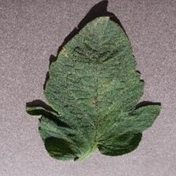
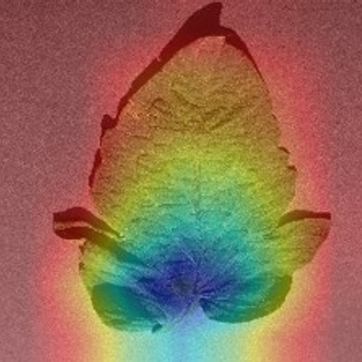

# 🌿 PLANT_DISEASE_DETECTION


A web-based plant disease detection system using **ResNet18** and **Grad-CAM**, built with **Streamlit**. Upload a leaf image to detect possible diseases in **Tomato**, **Potato**, or **Pepper** plants.

> Currently supports only **Tomato**, **Potato**, and **Pepper** based on the dataset used.

---


## 🚀 Features

- 🔍 Predicts plant disease from uploaded leaf images  
- 🔥 Grad-CAM heatmap for model interpretability  
- 🧾 Generates downloadable PDF reports  
- 💻 Interactive UI using **Streamlit**

---

## 🛠️ Installation

1. **Clone the repository:**

```bash
git clone https://github.com/Ashra-M/PLANT_DISEASE_DETECTION.git
cd PLANT_DISEASE_DETECTION
```

## Create & activate a virtual environment

```bash
# Windows
python -m venv venv
venv\Scripts\activate
```

## Install dependencies:
```bash
pip install -r requirements.txt
```

## Run the app:
```bash
streamlit run app.py 
```
---
 ## 🖼️ Sample Interface

| [Streamlit Page](assets/PlantDetectionPage.png)|

| Uploaded Image                          | Grad-CAM Output                        |
|-----------------------------------------|----------------------------------------|
|  |  |


---
## 🧠 Model Overview
The model is based on ResNet18, fine-tuned using the PlantVillage dataset filtered for the following:

Tomato (multiple disease types + healthy)

Potato (blight + healthy)

Pepper (bell, healthy and diseased)

Model was trained with class balancing and evaluated using accuracy and visual feedback (Grad-CAM).

---
## 📄 PDF Report Sample
When you click Download PDF Report, the app generates a downloadable file containing:

✅ Final top prediction (e.g., Tomato_Late_Blight)

📊 Class-wise confidence scores

🖼️ Uploaded image

🔥 Grad-CAM visualization
---

## 🧪 Future Improvements
Add support for more plant species

Deploy to cloud (HuggingFace, Streamlit Cloud, etc.)

Integrate camera input for real-time detection

Optimize model for mobile devices
---
## 📦 Dependencies
Main libraries used:

torch, torchvision – model and inference

opencv-python – Grad-CAM and image handling

streamlit – web interface

fpdf – PDF generation

Pillow, numpy, matplotlib

See requirements.txt for full list.
---
## 🗃️ Dataset
The model is trained using the PlantVillage Dataset, filtered to include only:

Tomato

Potato

Pepper

(You can modify dataset/ with your own data for other plants.)
---
## 📜 License
This project is licensed under the MIT License. See LICENSE file for full details.