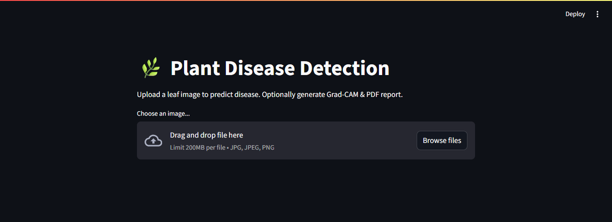

# 🌿 PLANT_DISEASE_DETECTION


A web-based plant disease detection system using **ResNet18** and **Grad-CAM**, built with **Streamlit**. Upload a leaf image to detect possible diseases in **Tomato**, **Potato**, or **Pepper** plants.

> Currently supports only **Tomato**, **Potato**, and **Pepper** based on the dataset used.

---


## 🚀 Features

- 🔍 Predicts plant disease from uploaded leaf images  
- 🔥 Grad-CAM heatmap for model interpretability  
- 🧾 Generates downloadable PDF reports  
- 💻 Interactive UI using **Streamlit**

---

## 🛠️ Installation

1. **Clone the repository:**

```bash
git clone https://github.com/Ashra-M/PLANT_DISEASE_DETECTION.git
cd PLANT_DISEASE_DETECTION
```

## 
2. **Create & activate a virtual environment:**

```bash
# Windows
python -m venv venv
venv\Scripts\activate
```

## 
3. **Install dependencies:**
```bash
pip install -r requirements.txt
```

## 
3. **Run the app:**
```bash
streamlit run app.py 
```
---

 ## 🖼️ Sample Interface

  


| Uploaded Image                          | Grad-CAM Output                        |
|-----------------------------------------|----------------------------------------|
|  |  |


---

## 📄 PDF Report Sample
**When you click Download PDF Report, the app generates a downloadable file containing:**

- ✅ Final top prediction (e.g., Tomato_Late_Blight)
- 📊 Class-wise confidence scores
- 🖼️ Uploaded image
- 🔥 Grad-CAM visualization

---

## 🧪 Future Improvements
   
     -Add support for more plant species
     -Deploy to cloud (HuggingFace, Streamlit Cloud, etc.)
     -Integrate camera input for real-time detection
     -Optimize model for mobile devices

---

## 📦 Dependencies

**Main libraries used:**

     torch, torchvision – model and inference
     
     opencv-python – Grad-CAM and image handling
     
     streamlit – web interface
     
     fpdf – PDF generation
     
     Pillow, numpy, matplotlib
> See [requirements.txt](requirements.txt) for full list.

---

## 🗃️ Dataset
**The model is trained using the PlantVillage Dataset, filtered to include only:**

  1. Tomato
  2. Potato
  3. Pepper
>You can modify dataset/ with your own data for other plants.

---

## 📜 License
This project is licensed under the [MIT License](LICENSE). See LICENSE file for full details.

---
